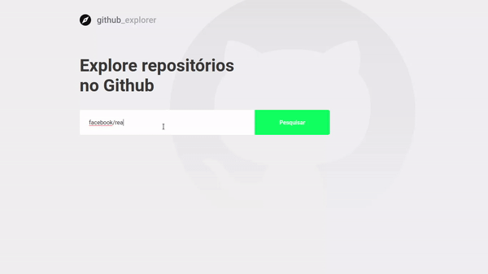
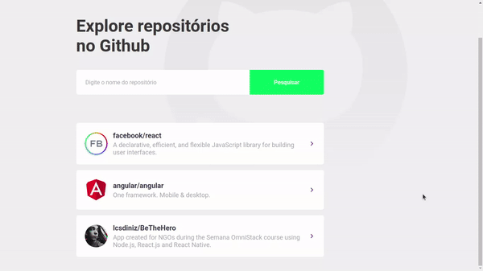

<p align="left">
    
  
  Search for your favorite repositories in this web application built with ReactJs and styled-components.
</p>


  [](https://www.linkedin.com/in/lcsdiniz/)
  [](#)
  [](https://github.com/lcsdiniz/github-explorer/stargazers)

<p align="center">
  
</p>

<p align="center">
  
</p>

## 📔 Features
* Search for github repositories and add them to your list;
* List of issues of a repository;
* Number of repository's stars, forks and open issues.

## 🛸 Technologies
This project was developed with the following technologies:
* TypeScript;
* ReactJs;
* styled-components.

## 🏁 Get started

### Clone this repository

```
git clone https://github.com/lcsdiniz/github-explorer.git
```

### Install dependencies
```
yarn install
```

### Start the application
```
yarn start
```

## 📮 Feedback

Feel free to send me feedback on [LinkedIn](https://www.linkedin.com/in/lcsdiniz/) or [file an
issue](https://github.com/lcsdiniz/github-explorer/issues/new). Feature requests are always welcome.

## 📢 Presented by

[Rocketseat](https://rocketseat.com.br/) 🚀.
